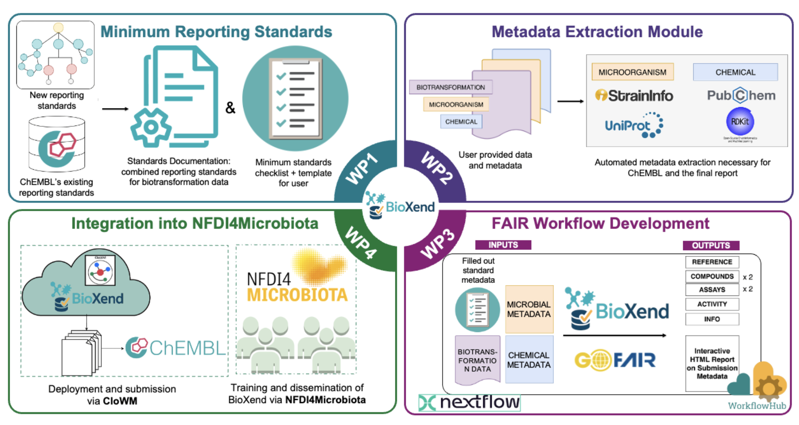

# BioXend 
BioXend is a new computational framework for submitting Microbial Biotransformation of Xenobiotics data. 

  

## MIX-MB Standards

**Minimum Information about Xenobiotics-Microbiome Biotransformation (MIX-MB)**

<!-- Uncomment these badges once the repo is set up -->
<!--  -->
<!--  -->
<!--  -->
<!--  -->

BioXend defines community-driven minimum reporting standards for xenobiotic microbial biotransformation data, enabling consistent data deposition to databases such as ChEMBL.

## Overview

### Community Standards

This project will be built on community consensus. The standards are informed by already existing standards, ChEMBL submission guidelines, an [open survey](https://forms.gle/towuMVYYuqDi7pEJ7). Please view the current results from the survey in [MIX-MB_Survey_Analysis.ipynb](https://github.com/zmahnoor14/BioXend/Standards/MIX-MB_Survey_Analysis.ipynb) notebook.

All participants are expected to follow our [Code of Conduct](CODE_OF_CONDUCT.md).

## Repository Structure

<to update later>

### For contributors

We welcome contributions to the standards, template, and pipeline! See our [Contributing Guide](CONTRIBUTING.md) for details. You can:

- **Propose changes** by opening an [issue](https://github.com/zmahnoor14/BioXend/issues/new/choose)
- **Submit a pull request** targeting the `devel` branch
- **Endorse proposals** by adding 👍 to issues and PRs you support
- **Discuss ideas** in [GitHub Discussions](https://github.com/zmahnoor14/BioXend/discussions)

Also link to the currnt project board: https://github.com/users/zmahnoor14/projects/6

### For future data submitters

1. Download the latest [`Template.xlsx`](Template.xlsx)
2. Read the `Template_Description` sheet for instructions
3. Fill in your data — green columns are mandatory, blue are recommended, purple are optional
4. Submit feedback on ease of use -- This template will be used as input to generate ready to submit ChEMBL files

## Versioning

Each standard document, the template, and the pipeline are versioned independently. The framework version increments with any component release. See [VERSION.md](VERSION.md) for details.

## License

This project is licensed under the [MIT License](LICENSE).

## Contact

- **Maintainers**: Mahnoor Zulfiqar — [ORCID](https://orcid.org/0000-0002-8330-4071), Eleonora Mastrorilli - [ORCID](https://orcid.org/0000-0003-2127-4150)
- **Institution**: EMBL, Molecular Systems Biology (MSB) Unit

## Funding
- [NFDI4Microbiota FlexFund 2026](https://nfdi4microbiota.de/newsroom/flexfunds/)
