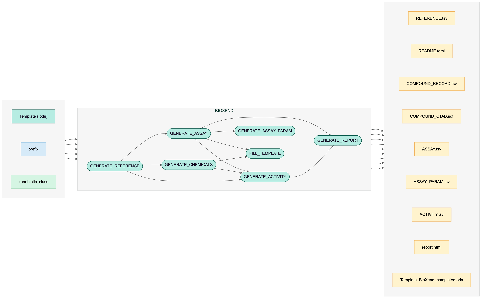
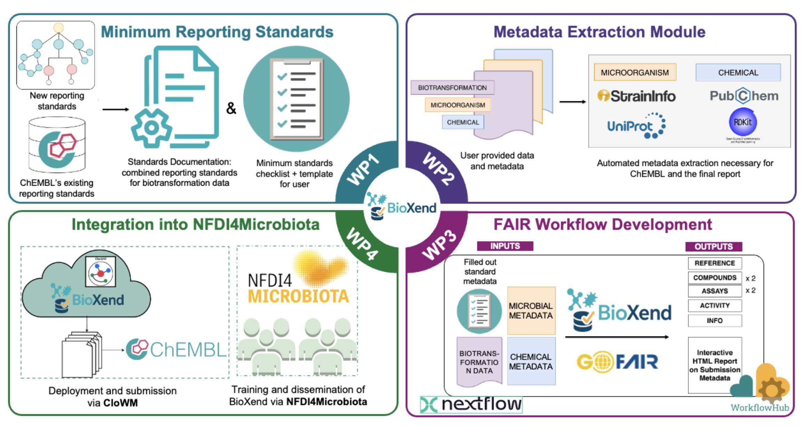

# BioXend 
BioXend is a computational framework to assist in submitting FAIR and AI-ready Microbial Biotransformation of Xenobiotics data to ChEMBL. You can check the webpage for BioXend project here: https://zmahnoor14.github.io/BioXend/. You can test and run the [BioXend workflow on CloWM](https://clowm.bi.denbi.de/workflows/019e411d-57d0-7c11-b67a-7ac13ccafa2d/version/12ffc8a8869178ac69c05925c312e5eb165581f9) by [NFDI4Microbiota](https://nfdi4microbiota.de/).

## 1. BioXend Submission Workflow

### 1.1 Target users checklist
This checklist helps you decide whether you should use BioXend for your data submission to ChEMBL. If you check atleast one box from all categories, this workflow is the right fit for your data submission. 

**Domain:**
- [ ] Microbiome Biotransformation of Chemical compounds/ Xenobiotics

**Type of assay:**
- [ ] Individual bacterial strain(/s)
- [ ] Bacterial protein/ enzyme (gene/protein identified)
- [ ] Undefined microbial community (gut metagenome, soil microbiome etc,)

**Xenobiotics:**
- [ ] Drugs / Pharmaceuticals
- [ ] Pesticides / Agrochemicals
- [ ] Environmental pollutants
- [ ] Food additives/ other small molecules
- [ ] Natural products / metabolites

**Endpoints:**
- [ ] Qualitative (compound metabolized / not metabolized)
- [ ] Quantitative (numerical: IC50, % biotransformation, etc.)
- [ ] Kinetic parameters (Km, Vmax, kcat)
- [ ] Metabolite detection (m/z, retention time, annotation)

**Measurement instruments:**
- [ ] LCMS(/MS)
- [ ] GCMS(/MS)

Based on the checklist above, you can contact ChEMBL prior to filling out your template or afterwards to show interest in submitting to their next release by contacting them at [chembl-depositors@ebi.ac.uk](mailto:chembl-depositors@ebi.ac.uk).

### 1.2 How to use the template
BioXend workflow takes a filled Template as input. In order to use the workflow, you have to fill out the template first. You can find the template in [`exampledata/Template_filled.ods`](/exampledata/Template_filled.ods). The template uses open ODS format (to be used in LibreOffice), but it can also be opened with Microsoft excel or google sheet, and after filling it out, can be saved as ODS file again. ODS is open format and hence is used for this project. For details on how template maps to chembl data format and other information, check the [MIX-MB Standards documentation](https://embl.gitbook.io/embl-docs/component-standards/mixmb_standards_main#template).  
The template is in ODS format and currently the workflow only accpets ODS template. You can however fill out the ODS file with MS-Excel and then save it in ODS format.

**Template explanation:** First sheet is the template description
- Each sheet description (Reference, Chemical, Micorbes, Experiment, Biotransformation)
- Row description, what each row mean, column name, description, actual values etc.
- Which columns are mandatory, recommended and optional
- What different data types mean

Actual template sheets are given below. Each column in each of the sheets has its description on how to fill out each column. 

**1. Reference:** This sheet requires dataset metadata such as:
- DOIs, and other identifiers
- Dataset metadata such as authors, abstract, whether its a publication 
- Submission metadata such as number of compounds and assays, endpoints etc.

**2. Chemicals:** This sheet requires xenobiotics data and metadata such as:
- Chemical identifiers (e.g: SMILES, common name)
- Stocks
- Chemical properties 
- Mass spectrometry relevant metadata such as instrument used, parent m/z values etc.

**3. Microbes:** This sheet requires bacterial assays data and metadata such as:
- Bacterial metadata (single strain, community TAX ID etc.)
- Assay metadata (e.g: is it ADMET assay or functional assay; the source of the assay)
- Target metadata (applicable if protein/ gene was identified that performs biotransformation)

**4. Experiment:** This sheet requires experimental metadata such as:
- Pre culture conditions
- Incubation period and whether multiple time points were measured
- oxygen conditions for microbes and so on.

**5. Biotransformation:** This sheet requires actual measured biotransformation of the xenobiotic mediated by microbe(s):
- biotransformation value
- activity type and comments
- kinetic parameters
- identified biotransformation product

Once you fill out the template, the next step is to test out the workflow on CloWM.

### 1.3 How to run the workflow

Access the workflow with the link: [BioXend workflow on CloWM](https://clowm.bi.denbi.de/workflows/019e411d-57d0-7c11-b67a-7ac13ccafa2d/version/12ffc8a8869178ac69c05925c312e5eb165581f9). 

**Steps to run the workflow:**

1. Access [CloWM](https://clowm.bi.denbi.de) anonymously or via LifeScience account. With anonymous login, you have 2 days of access to the results of the workflow.
2. After you login anonymously or with LS account, go to `Files` and select `My Data Bucket`. Here you can select your `initial-bucket-id`. Upload your filled out template here.
3. Now select `Workflows` from the navigation bar and then click on `Available Workflows`, find `BioXend` and launch the workflow.
4. You will see a page with workflow parameters, such as `--input`, `--outdir`, `prefix`, and `--xenobiotic_class`.  
5. Select the filled out template from you initial-bucket as your workflow `--input`.
6. Also for the `--outdir`, select your initial-bucket.
7. Aside from the filled template, there are two parameters: `--prefix` where you can add a prefix for the list of compounds. You can use the default as well. And there is the `--xenobiotic_class` parameter, where you can mention singular form of the type of xenobiotics you are working on, e.g: drug, pollutant etc. This will be used in the assay description section of the submission files.
8. Launch the workflow, and wait for the workflow to finish. The output files will appear in the initial-bucket.

### 1.4 How to submit the workflow output files
1. Contact the ChEMBL team at [chembl-depositors@ebi.ac.uk](mailto:chembl-depositors@ebi.ac.uk) with README.toml file. They will send you the instructions.
2. You can upload your workflow outputs to [Globus](https://docs.google.com/document/d/1Rwpswq4wI8RPK_fHYNwf7RKDLzJ5t-PoUn5VUfNJKJc/edit?usp=sharing). 
3. Submit feedback on ease of use via [issues](https://github.com/zmahnoor14/BioXend/issues/new/choose) or [discussion](https://github.com/zmahnoor14/BioXend/discussions) -- This template will be used as input to generate ready to submit ChEMBL files.

### Workflow DAG:

  

## 2. MIX-MB Standards

**Minimum Information about Xenobiotics-Microbiome Biotransformation (MIX-MB)**

📖 Full standards documentation: **[embl.gitbook.io/embl-docs](https://embl.gitbook.io/embl-docs)**

BioXend framework defines community-driven minimum reporting standards for xenobiotic microbial biotransformation data, enabling consistent data deposition to databases such as ChEMBL. The standards are informed by 
- already existing standards, 
- ChEMBL submission guidelines, 
- Domain specifications, and 
- an [open survey](https://forms.gle/towuMVYYuqDi7pEJ7). 

Please view the current results from the survey in [Standards/MIX-MB_Survey_Analysis.ipynb](Standards/MIX-MB_Survey_Analysis.ipynb) notebook.

## Project Work packages

  

## Citing This Work

The first release of BioXend / MIX-MB will be archived on [Zenodo](https://zenodo.org) and assigned a DOI, making the standards citable in academic publications.

## License

This project is licensed under the [MIT License](LICENSE).

## Institutions:
1. Michael Zimmermann group, Molecular Systems Biology (MSB) Unit, EMBL
2. Chemical Biology Group, EBI

## Funding
- [NFDI4Microbiota FlexFund 2026](https://nfdi4microbiota.de/newsroom/flexfunds/)
