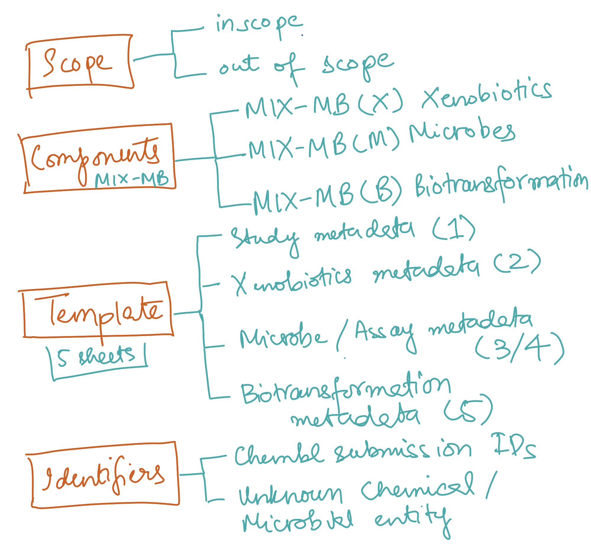

# Minimum Information about Xenobiotics-Microbiome Biotransformation (MIX-MB)

**Author:** Mahnoor Zulfiqar
**Version:** 0.1.1  
**Release Date:** March 16, 2026 (Draft)  
**Status:** Draft Standard  

---

## Document structure overview

  

## Table of Contents

- [Abstract](#abstract)
- [Scope and Applicability](#scope-and-applicability)
  - [In Scope](#in-scope)
  - [Out of Scope](#out-of-scope)
- [Component Standards](#component-standards)
- [Template](#template)
  - [1. Study Metadata Files](#1-study-metadata-files)
    - [How are study data files integrated into the Template.xlsx](#how-are-study-data-files-are-integrated-into-the-templatexlsx)
  - [2. Xenobiotics Metadata Files](#2-xenobiotics-metadata-files)
    - [How are xenobiotics data files integrated into the Template.xlsx](#how-are-xenobiotics-data-files-are-integrated-into-the-templatexlsx)
  - [3. Microbe / Assay Metadata Files](#3-microbe-assay-metadata-files)
    - [How are assay/microbe data files integrated into the Template.xlsx](#how-are-assaymicrobe-data-files-are-integrated-into-the-templatexlsx)
  - [4. Biotransformation Metadata File(s)](#4-biotransformation-metadata-files)
    - [How are biotransformation data files integrated into the Template.xlsx](#how-are-biotransformation-data-files-are-integrated-into-the-templatexlsx)
- [Identifiers and Cross-Referencing](#naming-convention-for-identifiers-and-cross-referencing-in-ChEMBL)
  - [Minting Scheme for Unknowns](#minting-scheme-for-unknowns)
- [ChEMBL Links and FAQs](#chembl-links-and-faqs)

---

## Abstract
Microbial biotransformation of xenobiotics — the enzymatic conversion of drugs, environmental contaminants, and dietary compounds by microorganisms — is a research area of growing importance for human health, toxicology, and drug development. Despite increasing scientific output, data from these studies are rarely reported in a standardised or FAIR-compliant manner, limiting their reuse and integration across laboratories and databases.

The **Minimum Information about Xenobiotics-Microbiome Biotransformation (MIX-MB)** standard defines the minimum metadata and data elements required to describe, share, and deposit xenobiotic biotransformation experiments. MIX-MB covers three interconnected aspects of every study: 
- the chemical substrate (MIX-MB(X)), 
- the microbial organism or community (MIX-MB(M)), and 
- the biotransformation assay and its outcomes (MIX-MB(B)). 
Together, these components ensure that study results are reproducible, comparable across research groups, and directly depositable into community databases such as [ChEMBL](https://www.ebi.ac.uk/chembl/).

This document is the top-level overview of the MIX-MB standard. It describes the component sub-standards, the ChEMBL submission file specifications, controlled vocabularies, and data quality tiers. It is intended for researchers generating biotransformation data, data curators, and software developers building tools that process or submit such data.

---

## Scope and Applicability

### In scope
MIX-MB applies to experimental studies that measure the biotransformation of one or more xenobiotic compounds by microbial organisms or microbial-derived systems. This includes:

- **In vitro assays** — single bacterial strain, and purified enzyme reactions
- **Community-level assays** — mixed microbial communities (e.g. gut microbiota, soil communities)
- **Time-course experiments** — measuring substrate depletion or product formation over time
<!--- - **Dose-response experiments** — measuring activity across a range of substrate concentrations --->
<!--- - **Ex vivo assays** — tissue or organ preparations with microbial activity --->
- **Product identification studies** — structural characterisation of biotransformation products
- **Non-xenobiotic substrates** — The standard focuses on Xenobiotics, however, the same fgramework can also be used for endogenous metabolites transformed by the bacteria
- **In vivo animal or human studies** — metabolic data from whole organisms without isolated microbial components
- **Microbial Kingdom** - The standard currently focuses on bacteria but can be applied to all microbial kingdoms: bacteria, archaea, and fungi.

### Out of scope

MIX-MB does not currently cover:

- **Purely computational predictions** of biotransformation (e.g. metabolite prediction tools with no experimental validation)
- **Metabolomics, Genomics or transcriptomics data** describing biotransformation enzymes or metabolites or equivalent sequence standards. This standard is for reporting biotransformation (bioactivity), and not for the experimental omics data (which have already their own established standards)

---

## Component Standards

This standard comprises three interconnected sub-standards: (individual components under construction)

| Component | Description | Version | Last Updated (YYYY-MM-DD) | Document |
|-----------|-------------|---------|--------------------------|----------|
| **MIX-MB(X)** - Xenobiotics | Minimum metadata required to describe the chemical substrate, including structural identity, physicochemical properties, and source information. | 0.1.1 | 2026-03-16 | [MIXMB_Xenobiotics.md](MIXMB_Xenobiotics.md) |
| **MIX-MB(M)** - Microbes | Minimum metadata required to describe the microbial organism or community used in the experiment, including taxonomy, strain, and culture conditions. | 0.1.1 | 2026-03-16 | [MIXMB_Microbes.md](MIXMB_Microbes.md) |
| **MIX-MB(B)** - Biotransformation | Minimum metadata required to describe the biotransformation assay design, experimental conditions, and quantitative or qualitative activity outcomes. | 0.1.1 | 2026-03-16 | [MIXMB_Biotransformation.md](MIXMB_Biotransformation.md) |

Please check the individual standards document above to understand each component.

---

## Template 

The template is based on the above 3 components ([MIXMB_Xenobiotics.md](MIXMB_Xenobiotics.md), [MIXMB_Microbes.md](MIXMB_Microbes.md), [MIXMB_Biotransformation.md](MIXMB_Biotransformation.md)) and the [ChEMBL submission guidelines](https://chembl.gitbook.io/chembl-data-deposition-guide). To understand the template, we first have to understand the ChEMBL submission file formats. [**ChEMBL** ](https://www.ebi.ac.uk/chembl/) is a database of bioactivity associated with small molecules, and is used within academia and industry as a highly curated repository. 

  

### 1. Study metadata files

**1.1. REFERENCE.tsv:**  
Reference file provides metadata regarding the study, including the DOI/ PMID, title, abstract, authors, journal, or dataset (if unpublished). For details please refer to the tutorial provided by ChEMBL on how to generate the [REFERENCE.tsv file](https://chembl.gitbook.io/chembl-data-deposition-guide/file-structure/field-names-and-data-types-minimal-data-submission/reference.tsv). 

**1.2. INFO.txt:**  
Optional file with free text space to mention any additional information about the study. For details please refer to the tutorial provided by ChEMBL on how to generate the [INFO.txt file](https://chembl.gitbook.io/chembl-data-deposition-guide/file-structure/supplementary-data-files/info.txt).

#### How are study data files are integrated into the Template.xlsx

The **Reference** sheet in `Template.xlsx` maps directly to `REFERENCE.tsv` and one column for `INFO.txt`. Fill in one row per study. Columns marked **Mandatory** must be completed; all others are optional or even can be automatically extracted by the nf workflow.

| Template Column | Maps to REFERENCE.tsv | Required | Description |
|----------------|----------------------|----------|-------------|
| `Reference_identifier` | `RIDX` | **Mandatory** | Meaningful unique identifier for each reference; if not provided, BioXend workflow will create one automatically |
| `DOI` | `DOI` | **Mandatory** | Must be present; if no DOI exists, contact ChEMBL to provide one |
| `PUBMED_ID` | `PUBMED_ID` | Mandatory only if no DOI | PubMed identifier; if DOI is present this field can be left empty |
| `DATA_LICENCE` | `DATA_LICENCE` | **Mandatory** | Licence for the deposited data; use `CC0` for public domain |
| `CONTACT` | — | Recommended | Contact person ORCID and/or email (e.g. `https://orcid.org/0000-0000-0000-0000`) |
| `JOURNAL_NAME` | `JOURNAL_NAME` | Optional | If published: use the standard NIH NLM Catalog abbreviated journal name |
| `YEAR` | `YEAR` | Recommended | Year of publication, dataset or submission |
| `VOLUME` | `VOLUME` | Optional | Volume number of the publication |
| `ISSUE` | `ISSUE` | Optional | Issue number of the publication |
| `FIRST_PAGE` | `FIRST_PAGE` | Optional | First page of the article |
| `LAST_PAGE` | `LAST_PAGE` | Optional | Last page of the article |
| `REF_TYPE` | `REF_TYPE` | Recommended | Type of reference: `Publication`, `Patent`, `Dataset`, or `Book` |
| `TITLE` | `TITLE` | Recommended | Title of the article or dataset description |
| `PATENT_ID` | `PATENT_ID` | Optional | Patent identifier (only relevant for ChEMBL internal use) |
| `ABSTRACT` | `ABSTRACT` | Recommended | Abstract of the article or dataset description |
| `AUTHORS` | `AUTHORS` | Recommended | List of the authors |
| `INFO` | — | Optional | Any additional context to include with the deposited data (ChEMBL internal usage only) |

### 2. Xenobiotics metadata files

**2.1. COMPOUND_RECORD.tsv:**  

These files contain reference identifiers and chemical identifiers, along with the name of the compound. For details please refer to the tutorial provided by ChEMBL on how to generate the [COMPOUND_RECORD.tsv file](https://chembl.gitbook.io/chembl-data-deposition-guide/file-structure/field-names-and-data-types-minimal-data-submission/compound_record.tsv).

**2.2. COMPOUND_CTAB.sdf:**   

The CTAB is an sdf file (V2000 molfile format) storing the chemical strcuture of the compounds mentioned in the `COMPOUNDS_RECORD.tsv`, together with the same chemical identifiers. For details please refer to the tutorial provided by ChEMBL on how to generate the [COMPOUND_CTAB.sdf file](https://chembl.gitbook.io/chembl-data-deposition-guide/file-structure/field-names-and-data-types-minimal-data-submission/compound_ctab.sdf).

#### How are xenobiotics data files are integrated into the Template.xlsx

The **Chemicals** sheet in `Template.xlsx` maps to `COMPOUND_RECORD.tsv` and `COMPOUND_CTAB.sdf`. Fill in one row per compound. Columns auto-filled by BioXend (powered by RDKit) can be left empty; all others should be completed where available.

| Template Column | Maps to | Required | Auto-filled by BioXend | Description |
|----------------|---------|----------|------------------------|-------------|
| `Chemical_identifier` | `CIDX` | **Mandatory** | Yes (if left empty) | Unique compound index; BioXend auto-generates if not provided — or supply your own |
| `Common_Name` | `COMPOUND_NAME` | **Mandatory** | No | Common name of the xenobiotic, chemical, drug, or pesticide |
| `SMILES` | `COMPOUND_CTAB.sdf file` | **Mandatory** | No | SMILES string of the compound |
| `Local_Synonym` | `COMPOUND_KEY` | **Mandatory**  | Yes (if left empty, COMPOUND_NAME will be used) | Any local synonym used in the manuscript (e.g. "compound 23") |
| `IUPAC_Name` | - | Recommended | Yes (if left empty) | Systematic IUPAC name; auto-filled by BioXend if not provided |
| `InChI` | - | Recommended | Yes (if left empty) | Standard InChI; auto-filled by BioXend if not provided |
| `InChIKey` | - | Recommended | Yes (if left empty) | InChIKey; auto-filled by BioXend if not provided |
| `database_ID` | - | Optional | No | ChEMBL, PubChem, or other database identifier; prefix with database name (e.g. `ChEMBL:CHEMBL25`) |
| `CAS_number` | — | Optional | No | CAS registry number of the xenobiotic |
| `Vendor` | — | Optional | No | Vendor who supplied the compound |
| `Purity` | — | Optional | No | Purity of the compound (%) |
| `Solubility` | — | Optional | No | Solubility value |
| `Stock_concentration` | — | Optional | No | Concentration of the stock solution |
| `Stock_solvent` | — | Optional | No | Solvent used to prepare the stock solution |
| `Molecular_formula` | - | Recommended | Yes (if left empty) | Molecular formula; auto-filled by BioXend if empty |
| `Molecular_weight` | - | Recommended | Yes (if left empty) | Molecular weight; auto-filled by BioXend if empty |
| `Monoisotopic_mass` | — | Optional | Yes (if left empty) | Monoisotopic mass; auto-filled by BioXend if empty |
| `m/z` | — | Optional | No | Measured m/z of the xenobiotic |
| `Column_separation` | — | Optional | No | Separation technique used (e.g. LC, GC) |
| `Retention_time` | — | Optional | No | Retention time recorded; fill if `Column_separation` is provided |
| `Time_unit` | — | Optional | No | Unit for retention time: `sec`, `min`, or `hr` |
| `Eluted_compound` | — | Optional | No | Was the eluted compound the same as the original? Note if different (relevant for MS/biotransformation studies) |
| `Eluted_compound_SMILES` | — | Optional | No | SMILES of the eluted compound if different from the original |
| `Physicochemical_properties` | — | Optional | Yes (partial) | LogP, functional groups, etc.; BioXend will auto-extract where possible — select from drop-down |
| `mzML_file_source` | — | Optional | No | Source file for MSI (mass spectrometry imaging) fragment data, if applicable |

### 3. Microbe/ Assay metadata files

**3.1. ASSAY.tsv:** 
`ASSAY.tsv` file gives description of the assay along with the microorganism, microbial community or microbial protein. For details please refer to the tutorial provided by ChEMBL on how to generate the [ASSAY.tsv file](https://chembl.gitbook.io/chembl-data-deposition-guide/file-structure/field-names-and-data-types-minimal-data-submission/assay.tsv). 

**3.2. ASSAY_PARAM.tsv:**  
Assay parameters associated with `ASSAY.tsv` are mentioned within this optional file. For details please refer to the tutorial provided by ChEMBL on how to generate the [ASSAY_PARAM.tsv file](https://chembl.gitbook.io/chembl-data-deposition-guide/file-structure/supplementary-data-files/assay_param.tsv-adding-additional-assay-information.).

#### How are assay/microbe data files are integrated into the Template.xlsx

The **Microbes** and **Experiment** sheets in `Template.xlsx` maps to `ASSAY.tsv` and `ASSAY_PARAM.tsv`. 

**Assay identity and sample metadata** (maps to `ASSAY.tsv`):

| Template Column | Maps to | Required | Auto-filled by BioXend | Description |
|----------------|---------|----------|------------------------|-------------|
| `assay_identifier` | `AIDX` | **Mandatory** | No | to be filled by user; any unique identifier is fine. This identifier will be used to differentiate between different assays |
| `internal_sample_identifier` | — | Optional | No | Internal identifier used in the manuscript or lab for the sample/assay |
| `Vendor` | — | Optional | No | Vendor or source from whom the strain/sample was obtained |
| `Sample_isolation_source` | `ASSAY_DESCRIPTION` (partial) | Recommended | No | Isolation source of the sample (e.g., blood, stool, soil) |
| `Human_donor_metadata` | — | Mandatory if human-derived | No | Donor metadata required if the sample originates from a human source |
| `Environmental_sample_metadata` | — | Mandatory if environmental | No | Environmental context required if sample comes from an environmental source |
| `ENAorSRA_project_Accession_number` | — | Recommended | No | ENA or SRA project accession number for deposited sequencing data |
| `ENAorSRA_sample_Accession_number` | — | Recommended | No | ENA or SRA sample accession number |
| `Bacteria_scientific_name` | `ASSAY_ORGANISM` | **Mandatory** | No | Scientific name of the bacterium; for communities, provide the community name |
| `Strain` | `ASSAY_DESCRIPTION` (partial) | Recommended | No | Strain name or identifier |
| `NCBI_Tax_ID` | `ASSAY_TAX_ID` | **Mandatory** | Yes (from scientific name via NCBI API) | BioXend will look up from `Bacteria_scientific_name` if left empty |
| `Tissue` | — | Optional | No | Tissue type if applicable (e.g., MRC-5) |
| `Cell_type` | — | Optional | No | Cell type description if a cell-based assay |
| `SUBCELLULAR_FRACTION` | `ASSAY_SUBCELLULAR_FRACTION` | Optional | No | Subcellular fraction used (e.g., cytoplasm, membrane) |
| `TARGET_TYPE` | `TARGET_TYPE` | Recommended | No | Type of target being assayed; refer to ChEMBL TARGET_TYPES (e.g., `ORGANISM`, `PROTEIN`, `CELL-LINE`) |
| `Protein_name` | — | Optional | No | Name of the protein if a protein/enzyme assay |
| `UniProt_ID` | — | Optional | Yes (from protein name via UniProt API) | BioXend will look up from `Protein_name` if left empty |
| `TARGET_ORGANISM` | `TARGET_ORGANISM` | Recommended | If left empty: Yes (from `Bacteria_scientific_name`) but if the target organism is different then dont leave empty and fill the scientific name of the organism | Auto-filled from scientific name if not provided |
| `TARGET_TAX_ID` | `TARGET_TAX_ID` | Recommended | Yes (from `NCBI_Tax_ID`) | Auto-filled from `NCBI_Tax_ID` if not provided |
| `Gene_name` | — | Optional | No | Gene name associated with the target protein |
| `ASSAY_GROUP` | `ASSAY_GROUP` | Optional | No | Group label for assays considered comparable by the depositor |
| `ASSAY_TYPE` | `ASSAY_TYPE` | **Mandatory** | No | ChEMBL assay type code; for MIX-MB use `B` (Biotransformation). Other codes: `A` = ADMET, `F` = Functional, `T` = Toxicity, `U` = Unclassified |

**Experimental conditions** (maps to `ASSAY_PARAM.tsv`):

You can ass more columns and they will appear as assay parameters for all your files.

| Template Column | Required | Description |
|----------------|----------|-------------|
| `Oxygen_conditions` | Recommended | if these conditions apply to all your assays, write `all` or `most` if most of the assays have these conditions; add another row if some of the assays have different conditions, and mention your self defined assay_identifier here, wither single, or a list of idenfiers with those conditions as a comma separated list |
| `Oxygen_conditions` | Recommended | Oxygen conditions (e.g., anaerobic/aerobic/CO2)|
| `Media_composition` | Recommended | Growth medium used (e.g., GMM, mBHI, minimal media) |
| `Incubation_temperature_celsius` | Recommended | Incubation temperature in °C |
| `Shaking_speed` | Optional | Shaking speed (rpm) during incubation |
| `Negative_controls` | Recommended | Negative controls used (e.g., heat-killed or sterile media) |
| `Pre-culture_preparation_and_conditions` | Optional | Pre-culture conditions before the main assay |
| `Antibiotic_pre-treatment` | Optional | Whether antibiotics were used; include name(s) of antibiotic(s) |
| `Biomass_inoculum_density_at_start` | Recommended | Biomass or inoculum density at the start of incubation |
| `Incubation_duration` | **Mandatory** | Total incubation time (numeric value, e.g., `24`) |
| `Time_unit` | **Mandatory** | Unit for incubation duration: `hr` or `day`; use one consistently |
| `Time-course_information` | Optional | Number and timing of timepoints for time-course studies (e.g., 0, 3, 6, 12, 24 hr) |
| `Biomass_inoculum_density_at_end` | Optional | Biomass or inoculum density at end of incubation |
| `Sample_storage` | Recommended | How and where samples were stored |
| `Sample_preparation` | Recommended | Details of how the sample was prepared for analysis |
| `Instrument_and_measurement` | Recommended | Instrument used for measurement; mention technology and instrument name (e.g., LC-MS, Orbitrap) |

### 4. Biotransformation metadata file(s)

**4.1. ACTIVITY.tsv:**
All biotransformation events occurring between `COMPOUND` and `ASSAY`, are mentioned in the `ACTIVITY.tsv`, including `no biotransformation` events. For details please refer to the tutorial provided by ChEMBL on how to generate the [ACTIVITY.tsv file](https://chembl.gitbook.io/chembl-data-deposition-guide/file-structure/field-names-and-data-types-minimal-data-submission/activity.tsv).

**4.2. Other optional activity files -  not part of the MIX-MB template**
- `ACTIVITY_PROPERTIES.tsv` - Adding context to experimental results.  
- `ACTIVITY_SUPP.tsv` - Multiplex assays, supporting data, and complex results sets.  

#### How are biotransformation data files are integrated into the Template.xlsx

The **Biotransformation** sheet in `Template.xlsx` maps to `ACTIVITY.tsv`. Each row links one compound to one assay and records the outcome of the biotransformation event.

| Template Column | Maps to | Required | Auto-filled by BioXend | Description |
|----------------|---------|----------|------------------------|-------------|
| `Chemical_identifier` | `CIDX` | **Mandatory** | Yes (from Xenobiotics sheet) | Auto-filled from the Xenobiotics sheet; supply your own defined identifier if preferred |
| `Common_Name` | — | **Mandatory**  | Yes (from Xenobiotics sheet) | Common name of the compound; auto-filled by BioXend |
| `SMILES` | — | Optional | Yes (from Xenobiotics sheet) | SMILES of the compound; auto-filled by BioXend |
| `ASSAY_identifier` | `AIDX` | **Mandatory** | No | Must match the `assay_identifier` from the Microbes sheet exactly; used to link activities to assays |
| `TEXT_VALUE` | `TEXT_VALUE` | Conditional | No | Use for non-numerical activity values (e.g., "biotransformed", "not detected"); leave empty if filling `VALUE` |
| `VALUE` | `VALUE` | Conditional | No | Numerical value of the activity measurement (e.g., IC50, % biotransformation); leave empty if filling `TEXT_VALUE` |
| `RELATION` | `RELATION` | Optional | No | Relational symbol for the `VALUE` (e.g., `=`, `>`, `<`, `~`) |
| `UPPER_VALUE` | `UPPER_VALUE` | Optional | No | Upper limit if the activity measurement is a range; use `VALUE` for the lower limit in that case |
| `UNITS` | `UNITS` | Recommended | No | Unit of the activity value (e.g., `%`, `µM`, `nM`) |
| `ACTIVITY_COMMENT` | `ACTIVITY_COMMENT` | Recommended | Yes (partial, if left empty) | Free-text details: thresholds, p-values, which rows are actives; BioXend will auto-populate from `VALUE` or `TEXT_VALUE` if left empty |
| `Metabolite_mz` | — | Optional | No | Measured m/z of the xenobiotic metabolite |
| `Metabolite_retention_time` | — | Optional | No | Measured retention time of the xenobiotic metabolite |
| `Metabolite_annotation` | — | Optional | No | Top annotation as SMILES, compound name, or chemical class (ChemONT); leave empty if no annotation was performed |
| `Metabolite_annotation_level` | — | Optional | No | Annotation confidence level 1–5; refer to MIX-MB documentation for level definitions |
| `Kinetic_parameter_type` | — | Optional | No | Type of kinetic parameter measured (e.g., `Km`, `Vmax`, `kcat`); fill only if kinetic data are available |
| `Kinetic_parameter_value` | — | Optional | No | Numerical value associated with the kinetic parameter type |
| `Reaction_type` | — | Recommended | No | Type of biotransformation reaction (e.g., hydrolysis, hydroxylation, reduction); for biotransformation assays only |
| `Activity_type` | `ACTIVITY_TYPE` | Recommended | No | User-defined activity label (e.g., `biotransformation`, `inhibition`); populate only for confirmed active compounds |
| `ACTION_TYPE` | `ACTION_TYPE` | Optional | No | ChEMBL-controlled vocabulary for the effect on the target (e.g., `INHIBITOR`, `SUBSTRATE`); populate only for confirmed active compounds; must match the ChEMBL ACTION_TYPE list |
| `Classify_activity` | — | Optional | No | Binary or categorical activity label (e.g., `0` = no activity, `1` = active); populate only for confirmed outcomes |

> **Note on TEXT_VALUE vs VALUE:** Use `TEXT_VALUE` when the result is qualitative (e.g., "metabolised", "no biotransformation detected"). Use `VALUE` when you have a quantitative measurement. Do not fill both columns in the same row.

## Naming convention for identifiers and cross-referencing in ChEMBL

**This is the first practical step before entering any data: assign identifiers to every entity in your study.**

MIX-MB uses a three-layer identifier system based on ChEMBL submission guidelines. Every biotransformation event is a record that links all three layers:

| Identifier | Abbreviation | Entity | Defined in | One example |
|-----------|-------------|--------|-----------|-----------|
| Reference Index | **RIDX** | Study / publication | `REFERENCE.tsv` | HumanDrugMetabolism |
| Compound Index | **CIDX** | Chemical compound |`COMPOUND_RECORD.tsv` | HDM001 |
| Assay Index | **AIDX** | Organism × condition | `ASSAY.tsv` | Bacteriodetes_theta_microaerobic |

All three identifiers must appear together in every row of `ACTIVITY.tsv` to create an unambiguous, linkable record of a biotransformation event.

### Minting Scheme for Unknowns

Not all entities will have established external identifiers at the time of submission. Use study-local identifiers with the following prefixes:

| Entity type | Prefix | Example |
|------------|--------|---------|
| Unknown compound (no structure, MSI Level 4–5) | `UNKNOWN_[RIDX]_[n]` | `UNKNOWN_GutMeta_M3` |
| Putatively characterised compound (MSI Level 3) | `PUTATIVE_[RIDX]_[n]` | `PUTATIVE_GutMeta_P1` |
| Novel microbial isolate (no TaxID registered) | Report at nearest known rank | Use species-level TaxID + note in `ACTIVITY_COMMENT` |

Once an unknown entity is formally identified and registered in an external database, update its identifier across all affected files before resubmission.

---

## ChEMBL links and FAQs
Here are some details on different files required by ChEMBL.
### Links: 
* Information on ChEMBL: https://chembl.gitbook.io/chembl-interface-documentation 
* ChEMBL submission guidelines: https://chembl.gitbook.io/chembl-data-deposition-guide 
### FAQs: 
1. General Questions: https://chembl.gitbook.io/chembl-interface-documentation/frequently-asked-questions/general-questions
2. Compounds: https://chembl.gitbook.io/chembl-interface-documentation/frequently-asked-questions/drug-and-compound-questions
3. Assay and activities: https://chembl.gitbook.io/chembl-interface-documentation/frequently-asked-questions/chembl-data-questions
4. Targets: https://chembl.gitbook.io/chembl-interface-documentation/frequently-asked-questions/target-questions