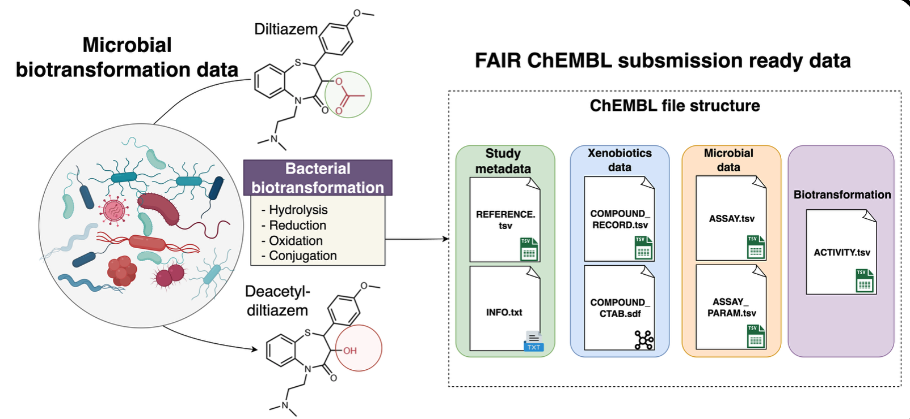

# Minimum Information about Xenobiotics-Microbiome Biotransformation (MIX-MB)

**Author:** Mahnoor Zulfiqar
**Version:** 0.1.1  
**Release Date:** March 16, 2026 (Draft)  
**Status:** Draft Standard  
**DOI:** XXXXXXX (to be assigned upon stable release)

---

## Table of Contents

- [Abstract](#abstract)
- [Scope and Applicability](#scope-and-applicability)
  - [In Scope](#in-scope)
  - [Out of Scope](#out-of-scope)
  - [Applicability Note](#applicability-note)
- [How to Use This Document](#how-to-use-this-document)
- [Component Standards](#component-standards)
- [Identifiers and Cross-Referencing](#identifiers-and-cross-referencing)
  - [Naming Your Compounds Properly](#naming-your-compounds-properly)
  - [Naming Your Organisms Properly](#naming-your-organisms-properly)
  - [Minting Scheme for Unknowns](#minting-scheme-for-unknowns)
  - [sameAs Linking Policy](#sameas-linking-policy)
- [ChEMBL Submission Files](#chembl-submission-files)
  - [Study Metadata Files](#study-metadata-files)
  - [Xenobiotics Metadata Files](#xenobiotics-metadata-files)
  - [Microbe / Assay Metadata Files](#microbe-assay-metadata-files)
  - [Biotransformation Metadata Files](#biotransformation-metadata-files)

---

## Abstract
Microbial biotransformation of xenobiotics — the enzymatic conversion of drugs, environmental contaminants, and dietary compounds by microorganisms — is a research area of growing importance for human health, toxicology, and drug development. Despite increasing scientific output, data from these studies are rarely reported in a standardised or FAIR-compliant manner, limiting their reuse and integration across laboratories and databases.

The **Minimum Information about Xenobiotics-Microbiome Biotransformation (MIX-MB)** standard defines the minimum metadata and data elements required to describe, share, and deposit xenobiotic biotransformation experiments. MIX-MB covers three interconnected aspects of every study: 
- the chemical substrate (MIX-MB(X)), 
- the microbial organism or community (MIX-MB(M)), and 
- the biotransformation assay and its outcomes (MIX-MB(B)). 
Together, these components ensure that study results are reproducible, comparable across research groups, and directly depositable into community databases such as [ChEMBL](https://www.ebi.ac.uk/chembl/).

This document is the top-level overview of the MIX-MB standard. It describes the component sub-standards, the ChEMBL submission file specifications, controlled vocabularies, and data quality tiers. It is intended for researchers generating biotransformation data, data curators, and software developers building tools that process or submit such data.

---

## Scope and Applicability

### In scope
MIX-MB applies to experimental studies that measure the biotransformation of one or more xenobiotic compounds by microbial organisms or microbial-derived systems. This includes:

- **In vitro assays** — single bacterial strain, and purified enzyme reactions
- **Community-level assays** — mixed microbial communities (e.g. gut microbiota, soil communities)
- **Time-course experiments** — measuring substrate depletion or product formation over time
<!--- - **Dose-response experiments** — measuring activity across a range of substrate concentrations --->
<!--- - **Ex vivo assays** — tissue or organ preparations with microbial activity --->
- **Product identification studies** — structural characterisation of biotransformation products
- **Non-xenobiotic substrates** — The standard focuses on Xenobiotics, however, the same fgramework can also be used for endogenous metabolites transformed by the bacteria
- **In vivo animal or human studies** — metabolic data from whole organisms without isolated microbial components
- **Microbial Kingdom** - The standard currently focuses on bacteria but can be applied to all microbial kingdoms: bacteria, archaea, and fungi.

### Out of scope

MIX-MB does not currently cover:

- **Purely computational predictions** of biotransformation (e.g. metabolite prediction tools with no experimental validation)
- **Metabolomics, Genomics or transcriptomics data** describing biotransformation enzymes or metabolites or equivalent sequence standards. This standard is for reporting biotransformation (bioactivity), and not for the experimental omics data (which have already their own established standards)

### Applicability note

Compliance with MIX-MB is recommended for studies intended for submission to public bioactivity databases (e.g. ChEMBL) or publications in journals that require FAIR data deposition. The standard defines three compliance tiers (Gold, Silver, Bronze) described in each component sub-standard.

---

## How to Use This Document

Different readers will need different parts of this standard. Use the table below to navigate directly to the sections most relevant to you.

| I am a… | I want to… | Start here |
|---------|-----------|-----------|
| **Data submitter** (researcher depositing study data) | Understand what metadata and files to prepare | [ChEMBL Submission Files](#chembl-submission-files), [Controlled Vocabularies](#controlled-vocabularies) |
| **Experimental scientist** (designing or reporting a study) | Know what to record during and after experiments | [Template](Templates/Template.xlsx), [Component Standards](#component-standards) |
| **Contributor** (proposing changes to the standard) | Understand the versioning policy and contribution process and edit the standards | [Versioning.md](Versioning.md), [CONTRIBUTING.md](../CONTRIBUTING.md), [Component Standards](#component-standards) |

---

## Component Standards

This standard comprises three interconnected sub-standards:

| Component | Description | Version | Last Updated (YYYY-MM-DD) | Document |
|-----------|-------------|---------|--------------------------|----------|
| **MIX-MB(X)** - Xenobiotics | Minimum metadata required to describe the chemical substrate, including structural identity, physicochemical properties, and source information. | 0.1.1 | 2026-03-16 | [MIXMB_Xenobiotics.md](MIXMB_Xenobiotics.md) |
| **MIX-MB(M)** - Microbes | Minimum metadata required to describe the microbial organism or community used in the experiment, including taxonomy, strain, and culture conditions. | 0.1.1 | 2026-03-16 | [MIXMB_Microbes.md](MIXMB_Microbes.md) |
| **MIX-MB(B)** - Biotransformation | Minimum metadata required to describe the biotransformation assay design, experimental conditions, and quantitative or qualitative activity outcomes. | 0.1.1 | 2026-03-16 | [MIXMB_Biotransformation.md](MIXMB_Biotransformation.md) |

Please check the individual standards document above to understand each component.

---

## Template 

The template is based on the above 3 components ([MIXMB_Xenobiotics.md](MIXMB_Xenobiotics.md), [MIXMB_Microbes.md](MIXMB_Microbes.md), [MIXMB_Biotransformation.md](MIXMB_Biotransformation.md)) and the [ChEMBL submission guidelines](https://chembl.gitbook.io/chembl-data-deposition-guide). To understand the template, we first have to understand the ChEMBL submission file formats. [**ChEMBL** ](https://www.ebi.ac.uk/chembl/) is a database of bioactivity associated with small molecules, and is used within academia and industry as a highly curated repository. 

  

### 1. Study metadata files

**1.1. REFERENCE.tsv:**  
Reference file provides metadata regarding the study, including the DOI/ PMID, title, abstract, authors, journal, or dataset (if unpublished). For details please refer to the tutorial provided by ChEMBL on how to generate the [REFERENCE.tsv file](https://chembl.gitbook.io/chembl-data-deposition-guide/file-structure/field-names-and-data-types-minimal-data-submission/reference.tsv). 

**1.2. INFO.txt:**  
Optional file with free text space to mention any additional information about the study. For details please refer to the tutorial provided by ChEMBL on how to generate the [INFO.txt file](https://chembl.gitbook.io/chembl-data-deposition-guide/file-structure/supplementary-data-files/info.txt).

#### How are study data files are integrated into the Template.xlsx

The **Reference** sheet in `Template.xlsx` maps directly to `REFERENCE.tsv` and one column for `INFO.txt`. Fill in one row per study. Columns marked **Mandatory** must be completed; all others are optional or even can be automatically extracted by the nf workflow.

| Template Column | Maps to REFERENCE.tsv | Required | Description |
|----------------|----------------------|----------|-------------|
| `Reference_identifier` | `RIDX` | **Mandatory** | Meaningful unique identifier for each reference; if not provided, BioXend workflow will create one automatically |
| `DOI` | `DOI` | **Mandatory** | Must be present; if no DOI exists, contact ChEMBL to provide one |
| `PUBMED_ID` | `PUBMED_ID` | Mandatory only if no DOI | PubMed identifier; if DOI is present this field can be left empty |
| `DATA_LICENCE` | `DATA_LICENCE` | **Mandatory** | Licence for the deposited data; use `CC0` for public domain |
| `CONTACT` | — | Recommended | Contact person ORCID and/or email (e.g. `https://orcid.org/0000-0000-0000-0000`) |
| `JOURNAL_NAME` | `JOURNAL_NAME` | Optional | If published: use the standard NIH NLM Catalog abbreviated journal name |
| `YEAR` | `YEAR` | Recommended | Year of publication, dataset or submission |
| `VOLUME` | `VOLUME` | Optional | Volume number of the publication |
| `ISSUE` | `ISSUE` | Optional | Issue number of the publication |
| `FIRST_PAGE` | `FIRST_PAGE` | Optional | First page of the article |
| `LAST_PAGE` | `LAST_PAGE` | Optional | Last page of the article |
| `REF_TYPE` | `REF_TYPE` | Recommended | Type of reference: `Publication`, `Patent`, `Dataset`, or `Book` |
| `TITLE` | `TITLE` | Recommended | Title of the article or dataset description |
| `PATENT_ID` | `PATENT_ID` | Optional | Patent identifier (only relevant for ChEMBL internal use) |
| `ABSTRACT` | `ABSTRACT` | Recommended | Abstract of the article or dataset description |
| `AUTHORS` | `AUTHORS` | Recommended | List of the authors |
| `INFO` | — | Optional | Any additional context to include with the deposited data (ChEMBL internal usage only) |

### 2. Xenobiotics metadata files

**2.1. COMPOUND_RECORD.tsv:**  

These files contain reference identifiers and chemical identifiers, along with the name of the compound. For details please refer to the tutorial provided by ChEMBL on how to generate the [COMPOUND_RECORD.tsv file](https://chembl.gitbook.io/chembl-data-deposition-guide/file-structure/field-names-and-data-types-minimal-data-submission/compound_record.tsv).

**2.2. COMPOUND_CTAB.sdf:**   

The CTAB is an sdf file (V2000 molfile format) storing the chemical strcuture of the compounds mentioned in the `COMPOUNDS_RECORD.tsv`, together with the same chemical identifiers. For details please refer to the tutorial provided by ChEMBL on how to generate the [COMPOUND_CTAB.sdf file](https://chembl.gitbook.io/chembl-data-deposition-guide/file-structure/field-names-and-data-types-minimal-data-submission/compound_ctab.sdf).

#### How are xenobiotics data files are integrated into the Template.xlsx

The **Xenobiotics** sheet in `Template.xlsx` maps to `COMPOUND_RECORD.tsv` and `COMPOUND_CTAB.sdf`. Fill in one row per compound. Columns auto-filled by BioXend can be left empty; all others should be completed where available.

| Template Column | Maps to | Required | Auto-filled by BioXend | Description |
|----------------|---------|----------|------------------------|-------------|
| `Chemical_identifier` | `CIDX` | **Mandatory** | Yes (if left empty) | Unique compound index; BioXend auto-generates if not provided — or supply your own |
| `Common_Name` | `COMPOUND_NAME` | **Mandatory** | No | Common name of the xenobiotic, chemical, drug, or pesticide |
| `SMILES` | `SMILES` | **Mandatory** | No | SMILES string of the compound |
| `Local_Synonym` | — | Optional | No | Any local synonym used in the manuscript (e.g. "compound 23") |
| `IUPAC_Name` | `IUPAC_NAME` | Recommended | Yes (if left empty) | Systematic IUPAC name; auto-filled by BioXend if not provided |
| `InChI` | `STANDARD_INCHI` | Recommended | Yes (if left empty) | Standard InChI; auto-filled by BioXend if not provided |
| `InChIKey` | `STANDARD_INCHI_KEY` | Recommended | Yes (if left empty) | InChIKey; auto-filled by BioXend if not provided |
| `database_ID` | `COMPOUND_KEY` | Optional | No | ChEMBL, PubChem, or other database identifier; prefix with database name (e.g. `ChEMBL:CHEMBL25`) |
| `CAS_number` | — | Optional | No | CAS registry number of the xenobiotic |
| `Vendor` | — | Optional | No | Vendor who supplied the compound |
| `Purity` | — | Optional | No | Purity of the compound (%) |
| `Solubility` | — | Optional | No | Solubility value |
| `Stock_concentration` | — | Optional | No | Concentration of the stock solution |
| `Stock_solvent` | — | Optional | No | Solvent used to prepare the stock solution |
| `Molecular_formula` | `MOLECULAR_FORMULA` | Recommended | Yes (if left empty) | Molecular formula; auto-filled by BioXend if empty |
| `Molecular_weight` | `MOLECULAR_WEIGHT` | Recommended | Yes (if left empty) | Molecular weight; auto-filled by BioXend if empty |
| `Monoisotopic_mass` | — | Optional | Yes (if left empty) | Monoisotopic mass; auto-filled by BioXend if empty |
| `m/z` | — | Optional | No | Measured m/z of the xenobiotic |
| `Column_separation` | — | Optional | No | Separation technique used (e.g. LC, GC) |
| `Retention_time` | — | Optional | No | Retention time recorded; fill if `Column_separation` is provided |
| `Time_unit` | — | Optional | No | Unit for retention time: `sec`, `min`, or `hr` |
| `Eluted_compound` | — | Optional | No | Was the eluted compound the same as the original? Note if different (relevant for MS/biotransformation studies) |
| `Eluted_compound_SMILES` | — | Optional | No | SMILES of the eluted compound if different from the original |
| `Physicochemical_properties` | — | Optional | Yes (partial) | LogP, functional groups, etc.; BioXend will auto-extract where possible — select from drop-down |
| `mMSI_file_source` | — | Optional | No | Source file for MSI (mass spectrometry imaging) fragment data, if applicable |

### 3. Microbe/ Assay metadata files

**3.1. ASSAY.tsv:** 
`ASSAY.tsv` file gives description of the assay along with the microorganism, microbial community or microbial protein. For details please refer to the tutorial provided by ChEMBL on how to generate the [ASSAY.tsv file](https://chembl.gitbook.io/chembl-data-deposition-guide/file-structure/field-names-and-data-types-minimal-data-submission/assay.tsv). 

| Column | Required | Type | Description |
|--------|----------|------|-------------|
| AIDX | Yes | String | Assay identifier |
| DESCRIPTION | Yes | String | Assay description |
| ASSAY_TYPE | Yes | String | Biotransformation/Metabolism |
| ASSAY_ORGANISM | Yes | String | Microorganism name |
| ASSAY_TAX_ID | Yes | Integer | NCBI Taxonomy ID |
| ASSAY_STRAIN | No | String | Strain designation |
| ASSAY_CELL_TYPE | No | String | Cell type/compartment |
| RIDX | Yes | String | Reference identifier |

**3.2. ASSAY_PARAM.tsv:**  
Assay parameters associated with `ASSAY.tsv` are mentioned within this optional file. For details please refer to the tutorial provided by ChEMBL on how to generate the [ASSAY_PARAM.tsv file](https://chembl.gitbook.io/chembl-data-deposition-guide/file-structure/supplementary-data-files/assay_param.tsv-adding-additional-assay-information.).

| Column | Required | Type | Description |
|--------|----------|------|-------------|
| AIDX | Yes | String | Assay identifier |
| TYPE | Yes | String | Parameter type |
| RELATION | No | String | =, <, >, ~, etc. |
| VALUE | Yes | Numeric | Parameter value |
| UNITS | No | String | Unit of measurement |
| TEXT_VALUE | No | String | Qualitative description |
| COMMENTS | No | String | Additional notes |

**Common Parameters:**
- Temperature (°C)
- Incubation time (hours)
- pH
- Cell density (OD600, CFU/mL)
- Substrate concentration (µM, mM)

### Biotransformation metadata file(s)

#### ACTIVITY.tsv
All biotransformation events occurring between `COMPOUND` and `ASSAY`, are mentioned in the `ACTIVITY.tsv`, including no biotransformation detected events. For details please refer to the tutorial provided by ChEMBL on how to generate the [ACTIVITY.tsv file](https://chembl.gitbook.io/chembl-data-deposition-guide/file-structure/field-names-and-data-types-minimal-data-submission/activity.tsv).

| Column | Required | Type | Description |
|--------|----------|------|-------------|
| CIDX | Yes | String | Compound identifier |
| AIDX | Yes | String | Assay identifier |
| RIDX | Yes | String | Reference identifier |
| TEXT_VALUE | No | String | Qualitative result |
| RELATION | No | String | =, <, >, ~ |
| VALUE | No | Numeric | Quantitative value |
| UNITS | No | String | Unit of measurement |
| TYPE | Yes | String | Activity type |
| ACTION_TYPE | No | String | SUBSTRATE, PRODUCT, etc. |
| ACTIVITY_COMMENT | No | String | Notes on activity |

**Activity Types for Biotransformation:**
- `Biotransformation` - General transformation
- `Metabolism` - Metabolic conversion
- `Substrate` - Compound consumed
- `Product` - Compound produced
- `Inhibition` - Transformation inhibited

#### Other optional activity files -  not part of the MIX-MB template
`ACTIVITY_PROPERTIES.tsv` - Adding context to experimental results.  
`ACTIVITY_SUPP.tsv` - Multiplex assays, supporting data, and complex results sets.  

## Identifiers and Cross-Referencing

**This is the first practical step before entering any data: assign identifiers to every entity in your study.**

MIX-MB uses a three-layer identifier system based on ChEMBL submission guidelines. Every biotransformation event is a record that links all three layers:

| Identifier | Abbreviation | Entity | Defined in |
|-----------|-------------|--------|-----------|
| Reference Index | **RIDX** | Study / publication | `REFERENCE.tsv` |
| Compound Index | **CIDX** | Chemical compound |`COMPOUND_RECORD.tsv` |
| Assay Index | **AIDX** | Organism × condition | `ASSAY.tsv` |

All three identifiers must appear together in every row of `ACTIVITY.tsv` to create an unambiguous, linkable record of a biotransformation event.

### Naming Your Compounds Properly

Use the **InChIKey** as the canonical chemical identifier for all known compounds — it is structure-based, database-independent, and collision-resistant. Alongside it, record the highest-priority external database identifier available:

1. ChEMBL ID (preferred — this is the target submission database)
2. PubChem CID
3. ChEBI ID
4. CAS Registry Number (fallback only)

See [MIX-MB(X) Section 1.4](MIXMB_Xenobiotics.md) for full CIDX minting rules and identifier priority.

### Naming Your Organisms Properly

Use the **NCBI TaxID** as the mandatory organism identifier for all assay entries (`ASSAY_TAX_ID`). Pair it with the full binomial scientific name (`ASSAY_ORGANISM`). For strains, add the culture collection identifier (e.g. ATCC, DSMZ) as an additional property.

See [MIX-MB(M) Section 1.4](MIXMB_Microbes.md) for full AIDX minting rules and organism identifier guidance.

### Minting Scheme for Unknowns

Not all entities will have established external identifiers at the time of submission. Use study-local identifiers with the following prefixes:

| Entity type | Prefix | Example |
|------------|--------|---------|
| Unknown compound (no structure, MSI Level 4–5) | `UNKNOWN_[RIDX]_[n]` | `UNKNOWN_GutMeta_M3` |
| Putatively characterised compound (MSI Level 3) | `PUTATIVE_[RIDX]_[n]` | `PUTATIVE_GutMeta_P1` |
| Novel microbial isolate (no TaxID registered) | Report at nearest known rank | Use species-level TaxID + note in `ACTIVITY_COMMENT` |

Once an unknown entity is formally identified and registered in an external database, update its identifier across all affected files before resubmission.

### sameAs Linking Policy

Use the `sameAs` property (schema.org / Bioschemas) to declare equivalence between an entity in your submission and the same entity in an external database. This is what makes MIX-MB data interoperable with ChEMBL, PubChem, NCBI, and other resources.

**Rules that apply across all component standards:**

1. **Compounds:** Link to ChEMBL, PubChem, and/or ChEBI using canonical compound page URLs. Required for Gold tier; strongly recommended for Silver. See [MIX-MB(X) Section 1.4](MIXMB_Xenobiotics.md).
2. **Organisms:** Link to the NCBI Taxonomy URL (mandatory) and LPSN (recommended for prokaryotes). See [MIX-MB(M) Section 1.4](MIXMB_Microbes.md).
3. **Unknowns:** Do not add `sameAs` until the entity has a confirmed, registered external record. Speculative `sameAs` links are not permitted.
4. **Deprecated identifiers:** If a linked database entry is merged or retired, update `sameAs` to the new canonical URL.

Activity records in `ACTIVITY.tsv` are not linked via `sameAs` directly — interoperability at the activity level is achieved through the consistent use of InChIKey (compounds) and NCBI TaxID (organisms). See [MIX-MB(B) Section 1.4](MIXMB_Biotransformation.md) for cross-referencing rules specific to activity records.

---

---
<!--
## 7. Controlled Vocabularies not defined by any ontologies?

### 7.1 Transformation Types

Use standardized terms:
- `hydroxylation` - Addition of hydroxyl group
- `reduction` - Reduction reaction
- `oxidation` - Oxidation reaction
- `hydrolysis` - Hydrolytic cleavage
- `decarboxylation` - Loss of CO₂
- `deamination` - Loss of amino group
- `conjugation` - Addition of molecular moiety
- `demethylation` - Loss of methyl group
- `acetylation` - Addition of acetyl group
- `glucuronidation` - Addition of glucuronic acid
- `sulfation` - Addition of sulfate group

### 7.2 Assay Types

- `cell-based assay` - Whole cell biotransformation
- `lysate assay` - Cell-free lysate system
- `purified enzyme assay` - Isolated enzyme
- `community assay` - Mixed microbial community
- `in vivo assay` - Animal model
- `ex vivo assay` - Extracted sample

### 7.3 Activity Outcomes

- `Substrate` - Compound consumed by microorganism
- `Product` - Compound produced by transformation
- `No Activity` - No biotransformation detected
- `Inhibition` - Transformation inhibited
- `Stimulation` - Transformation enhanced

#### TO DOs:
1. Vocabulary section?
2.
-->

## ChEMBL links and FAQs
Here are some details on different files required by ChEMBL.
#### Links: 
* Information on ChEMBL: https://chembl.gitbook.io/chembl-interface-documentation 
* ChEMBL submission guidelines: https://chembl.gitbook.io/chembl-data-deposition-guide 
#### FAQs: 
1. General Questions: https://chembl.gitbook.io/chembl-interface-documentation/frequently-asked-questions/general-questions
2. Compounds: https://chembl.gitbook.io/chembl-interface-documentation/frequently-asked-questions/drug-and-compound-questions
3. Assay and activities: https://chembl.gitbook.io/chembl-interface-documentation/frequently-asked-questions/chembl-data-questions
4. Targets: https://chembl.gitbook.io/chembl-interface-documentation/frequently-asked-questions/target-questions