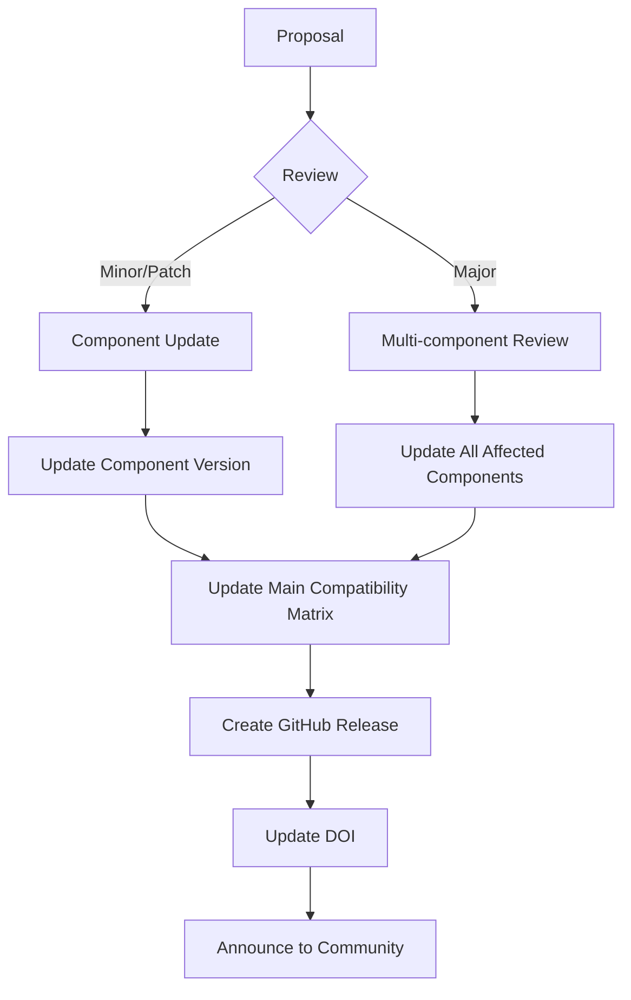

# MIX-MB Standards Versioning Guide

**Document Version:** 1.0  
**Last Updated:** February 5, 2026  
**Status:** Active

---

## 1. Overview

The MIX-MB (Minimum Information about Xenobiotics-Microbiome Biotransformation) standards use a **coordinated versioning strategy** that balances independence of components with overall standard coherence.

### 1.1 Versioning Idea

- **Component Independence:** Each sub-standard can evolve independently
- **Main Standard Coordination:** The umbrella standard tracks compatibility
- **Semantic Versioning:** Clear communication of change impact
- **Backward Compatibility:** Maintain support for previous versions where possible

---

## 2. Version Numbering System

### 2.1 Semantic Versioning (SemVer)

All MIX-MB standards follow **Semantic Versioning 2.0.0** (https://semver.org/):

```
MAJOR.MINOR.PATCH

Example: 2.3.1
         │ │ │
         │ │ └─── PATCH: Bug fixes, clarifications, typos
         │ └───── MINOR: New features, backward compatible
         └─────── MAJOR: Breaking changes, incompatible changes
```

### 2.2 Version Components

#### MAJOR Version (X.0.0)

Increment when making **incompatible changes**:

- Required fields become mandatory
- Field names or formats change
- Ontology terms are deprecated/replaced
- Data structure changes that break existing implementations
- Removal of previously supported features

**Example:**
```
v1.5.2 → v2.0.0
Change: SMILES field becomes mandatory (was recommended)
Impact: Existing datasets without SMILES are no longer compliant
```

#### MINOR Version (1.X.0)

Increment when adding **new features in a backward-compatible manner**:

- New optional fields added
- New ontology terms added to controlled vocabularies
- Extended examples or clarifications
- New data formats supported (alongside existing ones)
- Deprecated features (but still supported)

**Example:**
```
v1.4.3 → v1.5.0
Change: Added optional "environmental_fate" field to MIX-MB(X)
Impact: Old datasets remain valid; new datasets can include additional data
```

#### PATCH Version (1.2.X)

Increment for **backward-compatible bug fixes**:

- Typo corrections
- Clarifications to existing text
- Fixed broken links or references
- Corrected examples
- Documentation improvements
- No functional changes to the standard

**Example:**
```
v1.2.4 → v1.2.5
Change: Fixed InChI Key example format
Impact: No impact on data compliance
```

---

## 3. Standard Architecture

### 3.1 Main Standard (MIX-MB)

**File:** `MIXMB_Standards_main.md`

**Purpose:** Umbrella document that coordinates all component standards

**Version Format:** `MAJOR.MINOR`

**Version Header:**
```markdown
# Minimum Information about Xenobiotics-Microbiome Biotransformation (MIX-MB)

**MIX-MB Standard Version:** 1.1  
**Release Date:** February 5, 2026  
**Status:** Draft Standard  
**DOI:** 
```

### 3.2 Component Standards

Three independent but coordinated sub-standards:

| Component | File | Focus Area |
|-----------|------|------------|
| **MIX-MB(X)** | `MIXMB_Xenobiotics.md` | Chemical compounds, structures, properties |
| **MIX-MB(M)** | `MIXMB_Microbes.md` | Microorganisms, strains, cultivation |
| **MIX-MB(B)** | `MIXMB_Biotransformation.md` | Assays, measurements, activities |

**Version Format:** `MAJOR.MINOR.PATCH`

**Component Version Header:**
```markdown
# MIX-MB(X): Xenobiotics Component Standard

**Version:** 1.2.1  
**Release Date:** March 15, 2026  
**Status:** Stable Release  
**Part of:** MIX-MB Standard v1.1  
**Replaces:** MIX-MB(X) v1.2.0  
**Compatible with:** 
- MIX-MB(M) v1.0.0+
- MIX-MB(B) v1.0.0+

**Breaking Changes:** None (backward compatible with MIX-MB v1.0+)
```

---

## 4. Version Compatibility

### 4.1 Compatibility Matrix

The main standard maintains a compatibility matrix:

```markdown
## Version Compatibility Matrix

| MIX-MB | MIX-MB(X) | MIX-MB(M) | MIX-MB(B) | Release Date | Status |
|--------|-----------|-----------|-----------|--------------|--------|
| 2.0    | 2.0.0     | 2.0.0     | 2.0.0     | 2027-01-15   | Future |
| 1.2    | 1.3.0     | 1.2.0     | 1.1.0     | 2026-06-30   | Planned |
| 1.1    | 1.2.1     | 1.1.0     | 1.0.1     | 2026-03-15   | Current |
| 1.0    | 1.0.0     | 1.0.0     | 1.0.0     | 2026-02-05   | Supported |
```

### 4.2 Support Lifecycle

```
┌─────────────┬─────────────┬─────────────┬──────────────┐
│   Draft     │   Stable    │  Supported  │  Deprecated  │
│   (0.x.x)   │   (1.x.x)   │   (n-1.x)   │   (old)      │
└─────────────┴─────────────┴─────────────┴──────────────┘
     │              │              │              │
     └──────────────┴──────────────┴──────────────┘
      ← Active Development →  ← Maintenance →  ← Phase Out →
```

**Status Definitions:**

- **Draft (0.x.x):** Pre-release, breaking changes expected
- **Stable (1.x.x+):** Production-ready, semantic versioning enforced
- **Supported:** Previous major version, receives security/critical fixes
- **Deprecated:** No longer maintained, migration path provided

**Support Timeline:**
- **Current Version:** Full support, new features added
- **Previous Version (n-1):** Critical bug fixes only, 12 months support
- **Older Versions:** Deprecated, no support

---

## 5. Versioning Workflow

### 5.1 Release Process



### 5.2 Step-by-Step Release

#### Step 1: Determine Impact

**Questions to ask:**
- Does this break existing implementations? → **MAJOR**
- Does this add new optional fields/features? → **MINOR**
- Is this a clarification/fix with no functional change? → **PATCH**

#### Step 2: Update Component(s)

**For each affected component:**

1. Update version number in document header
2. Update "Replaces" field with previous version
3. Add entry to CHANGELOG section
4. Update examples if needed
5. Document breaking changes (if MAJOR)

**Example:**
```markdown
## CHANGELOG

### Version 1.3.0 (2026-04-20)

**Added:**
- New optional field `environmental_persistence` for xenobiotics
- Support for nanomaterials with size distribution data

**Changed:**
- Clarified ChEBI role hierarchy requirements
- Updated example for multi-component mixtures

**Deprecated:**
- Field `legacy_id` will be removed in v2.0.0
```

#### Step 3: Update Main Standard

1. Update version in `MIXMB_Standards_main.md`
2. Update compatibility matrix
3. Add release notes
4. Update status if needed (Draft → Stable)

#### Step 4: Create GitHub Release

```bash
# Tag the release
git tag -a v1.1-X1.2.1-M1.1.0-B1.0.1 -m "MIX-MB v1.1 Release"

# Push tags
git push origin --tags

# Create GitHub Release with:
# - Release notes
# - Compiled PDF versions
# - Example datasets
# - Migration guide (if MAJOR)
```

#### Step 5: Update DOI (Zenodo)

- Upload new version to Zenodo
- Link to GitHub release
- Update related identifiers

#### Step 6: Community Announcement

Announce through:
- GitHub Discussions
- NFDI4Microbiota mailing list
- Standards working group
- Twitter/Mastodon with #MIXMB

---

## 6. Version Dependencies

### 6.1 Component Dependency Rules

**Rule 1: Forward Compatibility**
```
MIX-MB(X) v1.2.x is compatible with:
- MIX-MB(M) v1.0.0 or higher
- MIX-MB(B) v1.0.0 or higher
```

**Rule 2: Major Version Alignment**
```
When MIX-MB(X) reaches v2.0.0:
- Recommend updating MIX-MB(M) to v2.0.0
- May require MIX-MB(B) v2.0.0 if changes affect interfaces
```

**Rule 3: Independent Minor/Patch Updates**
```
MIX-MB(M) can go from v1.0.0 → v1.5.0
Without requiring updates to MIX-MB(X) or MIX-MB(B)
```

### 6.2 Declaring Dependencies

**In component headers:**
```markdown
**Requires:**
- MIX-MB(X) >= 1.2.0, < 2.0.0
- MIX-MB(M) >= 1.1.0, < 2.0.0

**Optional Compatibility:**
- MIX-MB(X) v2.0.0+ (with migration adapter)
```

---

## 7. Deprecation Policy

### 7.1 Deprecation Process

**Timeline:**
```
Version n     Version n+1     Version n+2     Version n+3
    │              │               │               │
    │         Deprecation     Final Warning    Removal
    │          Announced       (Required)     (Breaking)
    └──────────────┴───────────────┴───────────────┘
          6 months        6 months        Next MAJOR
```

**Example:**
```markdown
## MIX-MB(X) v1.4.0 (2026-05-01)

**Deprecated:**
⚠️ Field `compound_id` is deprecated and will be removed in v2.0.0
   Use `identifier` with `identifier_type` instead
   
**Migration Guide:**
```
# Old format (deprecated)
compound_id: "CHEMBL123"

# New format (recommended)
identifier: "CHEMBL123"
identifier_type: "ChEMBL ID"
```

Support timeline:
- v1.4.0 - v1.x.x: Both formats accepted
- v2.0.0+: Only new format accepted
```

### 7.2 Communication

**Deprecation Notice Must Include:**
1. What is being deprecated
2. Why it's being deprecated
3. What to use instead
4. Timeline for removal
5. Migration code/examples
6. Contact for questions

---

## 8. Branching Strategy

### 8.1 Git Branch Model

```
main (stable releases)
├── develop (integration branch)
│   ├── feature/xenobiotics-nanomaterials
│   ├── feature/microbes-metagenomics
│   └── bugfix/typo-chembl-examples
└── release/v1.1 (release preparation)
```

**Branch Types:**

- **main:** Only stable releases (tagged)
- **develop:** Integration branch for next release
- **feature/*:** New features (MINOR version bumps)
- **bugfix/*:** Bug fixes (PATCH version bumps)
- **release/vX.Y:** Release preparation branch
- **hotfix/vX.Y.Z:** Urgent fixes to released versions

### 8.2 Branch Workflow

```bash
# Start new feature
git checkout develop
git checkout -b feature/xenobiotics-nanomaterials

# Complete feature
git checkout develop
git merge --no-ff feature/xenobiotics-nanomaterials

# Prepare release
git checkout -b release/v1.2 develop
# Update versions, changelogs
git commit -m "Bump version to 1.2.0"

# Finalize release
git checkout main
git merge --no-ff release/v1.2
git tag -a v1.2 -m "MIX-MB v1.2 Release"
git checkout develop
git merge --no-ff release/v1.2
```

---

## 9. Version Citation

### 9.1 How to Cite

**Full Standard Suite:**
```
Zulfiqar, M., et al. (2026). Minimum Information about Xenobiotics-Microbiome 
Biotransformation (MIX-MB) Standard v1.1. Zenodo. 
https://doi.org/10.5281/zenodo.XXXXXXX
```

**Specific Component:**
```
Zulfiqar, M., et al. (2026). MIX-MB(X): Xenobiotics Component Standard v1.2.1. 
Part of MIX-MB v1.1. Zenodo. 
https://doi.org/10.5281/zenodo.XXXXXXX
```

### 9.2 Version Identifiers in Data

**In submitted datasets:**
```json
{
  "metadata": {
    "standard": "MIX-MB",
    "standard_version": "1.1",
    "components": {
      "xenobiotics": "1.2.1",
      "microbes": "1.1.0",
      "biotransformation": "1.0.1"
    },
    "compliance_date": "2026-03-15"
  }
}
```

---

## 10. Version Decision Trees

### 10.1 Which Version to Bump?

```
START: What changed?
│
├─ Fixed typo/broken link? → PATCH (x.y.Z)
│
├─ Added optional field? → MINOR (x.Y.0)
│
├─ Made optional field required? → MAJOR (X.0.0)
│
├─ Changed field name? → MAJOR (X.0.0)
│
├─ Removed deprecated feature? → MAJOR (X.0.0)
│
├─ Added new ontology term? → MINOR (x.Y.0)
│
├─ Changed ontology requirement? → MAJOR (X.0.0)
│
└─ Documentation clarification only? → PATCH (x.y.Z)
```

### 10.2 Which Standards to Update?

```
START: What was changed?
│
├─ Only xenobiotic fields?
│   └─ Update MIX-MB(X) only
│
├─ Only microbe fields?
│   └─ Update MIX-MB(M) only
│
├─ Only assay fields?
│   └─ Update MIX-MB(B) only
│
├─ Links between components?
│   ├─ Update affected components
│   └─ Update main standard compatibility matrix
│
└─ Overarching policy/structure?
    └─ Update main standard version
```

---

## 11. Version Review Checklist

### 11.1 Before Release

**Component Standard:**
- [ ] Version number updated in header
- [ ] "Replaces" field updated with previous version
- [ ] CHANGELOG entry added with date
- [ ] All examples updated to reflect changes
- [ ] Breaking changes documented (if MAJOR)
- [ ] Migration guide provided (if MAJOR)
- [ ] Compatible versions listed
- [ ] Status updated (Draft/Stable/Deprecated)

**Main Standard:**
- [ ] Main version updated
- [ ] Compatibility matrix updated
- [ ] Release notes written
- [ ] All component versions listed correctly
- [ ] Support lifecycle documented
- [ ] Migration paths described (if needed)

**Repository:**
- [ ] All tests pass
- [ ] Example datasets validated
- [ ] Documentation built successfully
- [ ] Git tag prepared
- [ ] Release notes drafted in GitHub

**Communication:**
- [ ] Announcement prepared
- [ ] Migration guide available
- [ ] Community notified
- [ ] DOI reserved/updated

---

## 12. Versioning Tools

### 12.1 Automated Version Checking

**Python script to validate version compliance:**

```python
# filepath: ./003_Experiments/DataAnalysis/ZM009A_DryLab/bin/check_version.py

import re
import json

def parse_version(version_string):
    """Parse semantic version string."""
    pattern = r'^(\d+)\.(\d+)\.(\d+)$'
    match = re.match(pattern, version_string)
    if not match:
        raise ValueError(f"Invalid version format: {version_string}")
    return tuple(map(int, match.groups()))

def is_compatible(required, current):
    """Check if current version is compatible with required version."""
    req_major, req_minor, req_patch = parse_version(required)
    cur_major, cur_minor, cur_patch = parse_version(current)
    
    # Same major version, current >= required
    if cur_major == req_major:
        if cur_minor > req_minor:
            return True
        if cur_minor == req_minor and cur_patch >= req_patch:
            return True
    
    return False

def validate_dataset_version(dataset_metadata):
    """Validate that dataset uses compatible standard versions."""
    standard_version = dataset_metadata.get("standard_version")
    components = dataset_metadata.get("components", {})
    
    # Check component compatibility
    min_versions = {
        "xenobiotics": "1.0.0",
        "microbes": "1.0.0",
        "biotransformation": "1.0.0"
    }
    
    for component, min_version in min_versions.items():
        current = components.get(component)
        if not current:
            print(f"⚠️  Warning: Missing version for {component}")
            continue
        
        if is_compatible(min_version, current):
            print(f"✓ {component} v{current} is compatible (>= {min_version})")
        else:
            print(f"✗ {component} v{current} is incompatible (requires >= {min_version})")
    
    return True

# Example usage
if __name__ == "__main__":
    metadata = {
        "standard": "MIX-MB",
        "standard_version": "1.1",
        "components": {
            "xenobiotics": "1.2.1",
            "microbes": "1.1.0",
            "biotransformation": "1.0.1"
        }
    }
    
    validate_dataset_version(metadata)
```

### 12.2 Version Badge Generator

**For documentation:**

```markdown

-v1.2.1-green)
-v1.1.0-green)
-v1.0.1-green)

```

---

## 13. Version History Template

### 13.1 CHANGELOG Format

Each component should maintain a CHANGELOG following [Keep a Changelog](https://keepachangelog.com/):

```markdown
# Changelog

All notable changes to MIX-MB will be documented in this file.

The format is based on [Keep a Changelog](https://keepachangelog.com/en/1.0.0/),
and this project adheres to [Semantic Versioning](https://semver.org/spec/v2.0.0.html).

## [Unreleased]

### Added
- Placeholder for upcoming features

## [1.2.1] - 2026-03-15

### Fixed
- Corrected InChI Key format in Example 3.2
- Fixed broken link to ChEBI ontology browser

### Documentation
- Clarified stereochemistry reporting requirements
- Added troubleshooting section for SMILES validation

## [1.2.0] - 2026-02-28

### Added
- New optional field `environmental_fate` for persistence data
- Support for reporting metabolite stereochemistry
- Extended examples for prodrug biotransformation

### Changed
- Improved clarity of ChEBI role hierarchy explanation
- Updated BioSchemas examples to v1.0 specification

### Deprecated
- Field `legacy_compound_id` (use `identifier` with `identifier_type` instead)

## [1.1.0] - 2026-02-15

### Added
- Optional field for predicted ADME properties
- Support for reporting mixture components

### Fixed
- Corrected molecular weight units in examples

## [1.0.0] - 2026-02-05

### Added
- Initial stable release
- Complete Bioschemas integration
- ChEBI and ChemOnt ontology support
- Comprehensive examples and validation rules

[Unreleased]: https://github.com/org/repo/compare/v1.2.1...HEAD
[1.2.1]: https://github.com/org/repo/compare/v1.2.0...v1.2.1
[1.2.0]: https://github.com/org/repo/compare/v1.1.0...v1.2.0
[1.1.0]: https://github.com/org/repo/compare/v1.0.0...v1.1.0
[1.0.0]: https://github.com/org/repo/releases/tag/v1.0.0
```

---

## 14. FAQs

### Q1: Can I use different versions of component standards together?

**A:** Yes, as long as they are within compatible version ranges. Check the compatibility matrix in the main standard document. Generally:
- Different MINOR/PATCH versions within the same MAJOR version are compatible
- Different MAJOR versions may require adapters or migration

### Q2: How do I know if my dataset complies with a specific version?

**A:** Include version metadata in your dataset and use the validation script (Section 12.1). Your dataset should declare which standard versions it follows.

### Q3: What happens when a standard reaches v2.0?

**A:** A MAJOR version change indicates breaking changes. We provide:
- 12-month support for v1.x
- Detailed migration guide
- Automated conversion tools where possible
- Parallel submission support during transition period

### Q4: Can I propose changes to the standard?

**A:** Yes! Submit an issue or pull request on GitHub. Changes are reviewed by the standards committee and community before inclusion. Please make sure it is compatible/ complementary to ChEMBL guidelines.

### Q5: How often are standards updated?

**A:** 
- **PATCH releases:** As needed (bug fixes)
- **MINOR releases:** Every 3-6 months
- **MAJOR releases:** Approximately every 18-24 months

---

## 15. Contact and Governance

### 15.1 Standards Committee

**Current Members:**
- Mahnoor Zulfiqar (Lead, NFDI4Microbiota)
- [Additional committee members]

**Responsibilities:**
- Review proposed changes
- Approve version releases
- Maintain versioning policy
- Coordinate with community

### 15.2 How to Contribute

1. **GitHub Issues:** Report bugs or suggest features
2. **Pull Requests:** Submit changes with clear description
3. **Discussions:** Join community discussions on GitHub
4. **Working Group:** Participate in quarterly review meetings

### 15.3 Decision Process

```
Proposal → Community Review (2 weeks) → Committee Review → 
Decision (Approve/Revise/Reject) → Implementation → Release
```
