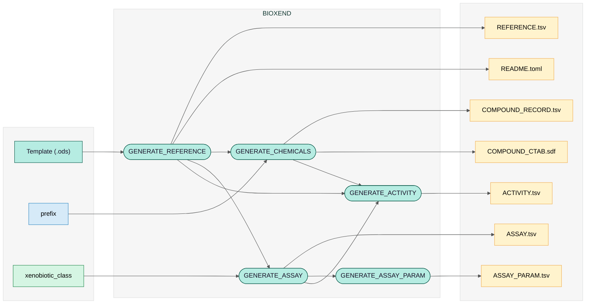

## Outputs

BioXend generates 7 files from a filled-out `Template_open.ods`. Seven are ChEMBL-ready deposition files published to `--outdir` (default: `results/`); three are internal intermediate files not written to the output directory.

### Pipeline overview

---

### Output files

1. `REFERENCE.tsv` : Publication metadata in ChEMBL deposition format.
2. `README.toml`: Submission metadata file summarising the dataset. 
3. `COMPOUND_RECORD.tsv`: Compound records indexed by CIDX in ChEMBL deposition format.
4. `COMPOUND_CTAB.sdf`: 2D chemical structures generated by RDKit for all compounds in `COMPOUND_RECORD.tsv`. Each entry is keyed by CIDX.
5. `ASSAY.tsv`: Assay descriptions per organism/condition in ChEMBL deposition format.
6. `ASSAY_PARAM.tsv`: Experimental parameters linked to each assay entry by AIDX.
7. `ACTIVITY.tsv`: Compound–assay activity links in ChEMBL deposition format. This is the primary output connecting chemicals to biotransformation assays.

### Intermediates (not published)

| File | Produced by | Used by |
|------|-------------|---------|
| `COMPOUND_MAPPING.tsv` | GENERATE_CHEMICALS | GENERATE_ACTIVITY |
| `ASSAY_MAPPING.tsv` | GENERATE_ASSAY | GENERATE_ASSAY_PARAM, GENERATE_ACTIVITY |
| `RIDX.txt` | GENERATE_REFERENCE | GENERATE_CHEMICALS, GENERATE_ASSAY, GENERATE_ACTIVITY |